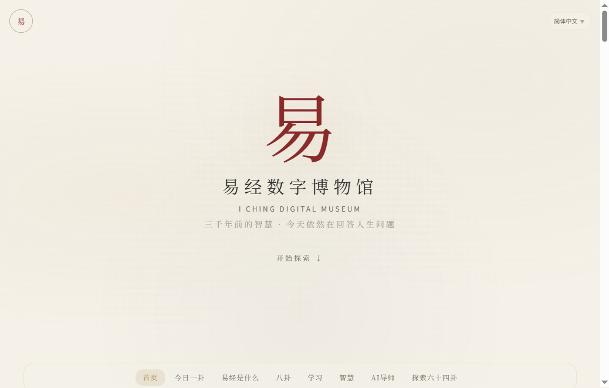
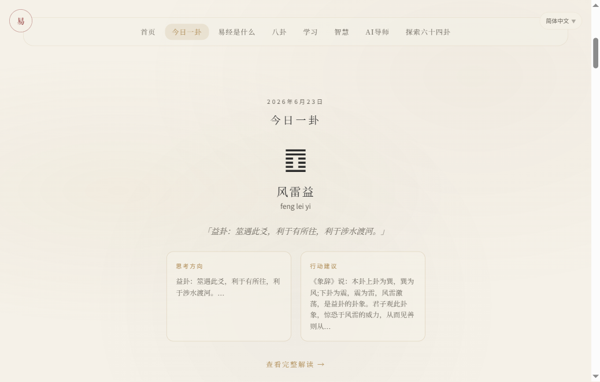
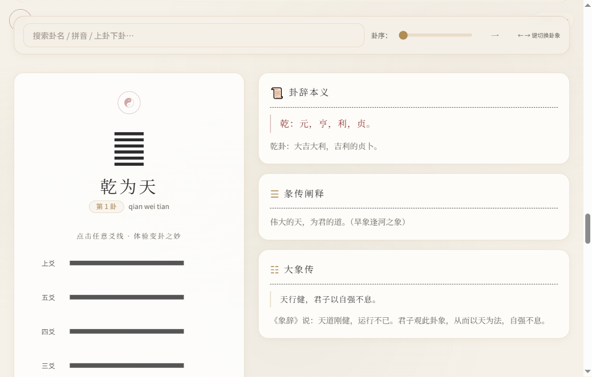

# 易经数字博物馆 · I Ching Digital Museum

[](https://mr-liu-cug.github.io/iching-museum/)
[](https://nextjs.org/)
[](https://www.typescriptlang.org/)
[]()

> 三千年前的智慧 · 今天依然在回答人生问题

面向现代人的易经数字学习平台。以宋韵美学为骨，以现代 Web 技术为翼——一座可以在浏览器中深度探索的东方哲学数字博物馆。

🔗 **在线访问：[mr-liu-cug.github.io/iching-museum](https://mr-liu-cug.github.io/iching-museum/)**

---

## 预览

| Hero | 今日一卦 | 六十四卦探索 |
|------|---------|-------------|
|  |  |  |

---

## 项目定位

这不是算命网站，不是风水网站，也不是六十四卦查询工具。

这是一座**面向现代人的易经数字学习平台**：

- **Story First** — 先讲故事激发兴趣，再传递知识，避免直接堆砌古文
- **哲学导向** — 强调变化规律与认知提升，不做吉凶断言和命运预测
- **AI 辅助** — AI 国学导师提供思考框架，不预测未来

---

## 展厅导览

页面以**连续滚动博物馆**形式组织：

| 展区 | 模块 | 说明 |
|------|------|------|
| Hero | `HeroSection` | 全屏大"易"字、博物馆标题、探索入口 |
| 今日一卦 | `DailyHexagram` | 每日卦象、智慧箴言、思考方向与行动建议 |
| 易经是什么 | `WhatIsIChing` | 伏羲→文王→孔子→现代 时间线 |
| 八卦导航 | `BaguaNavSection` | ☰☱☲☳☴☵☶☷ 点击跳转对应卦宫 |
| 学习路径 | `LearningPathSection` | 5级18课，含互动练习与历史案例 |
| 人生智慧 | `WisdomTopics` | 10大主题·47个人生场景，问题→卦象→建议 |
| AI 导师 | `AITutorEntry` | 实时对话，哲学引导（静态部署下不可用） |
| 大易通识 | `PrologueSection` | 易道渊源 / 揲蓍求卦 / 历代圣贤 / 现代启示 |
| 六十四卦 | `HexagramExplorer` | 核心展厅：变卦模拟、诸家解卦、关系图谱、全景矩阵 |

### 六十四卦交互功能

- **六爻点击变卦** — 点击爻线阴阳互变，实时生成本卦/变卦/互卦/错卦/综卦
- **卦序滑块** — 按周文王通行卦序（1–64）快速浏览
- **模糊搜索** — 支持卦名、拼音、上下卦组合搜索
- **键盘导航** — ← → 键切换卦象
- **诸家解卦** — 邵雍 / 傅佩荣 / 传统 / 张铭仁 四 Tab
- **现代五维之思** — 事业/财富/情感/身心/人际 哲学解读
- **D3.js 关系图谱** — 本卦→变卦/错卦/综卦/互卦/六爻变卦网络
- **全景矩阵** — 8×8 伏羲先天方阵，64格可点击

---

## 技术栈

| 类别 | 技术 |
|------|------|
| 框架 | Next.js 16 (App Router, Turbopack) |
| 语言 | TypeScript |
| 样式 | TailwindCSS v4 |
| 动画 | Framer Motion v12 |
| 状态管理 | Zustand v5 |
| 可视化 | D3.js v7 |
| 国际化 | 自研 useTranslation Hook |
| AI | DeepSeek API (SSE 流式) |
| 部署 | GitHub Pages (静态导出, `output: "export"`) |

---

## 本地开发

```bash
# 安装依赖
npm install

# 启动开发服务器
npm run dev
# → http://localhost:3000

# 构建静态站点
npm run build

# 部署到 GitHub Pages
GITHUB_PAGES=true npm run build
# 将 out/ 目录推送到 gh-pages 分支
```

### 环境变量

创建 `.env.local`（AI 导师功能需要）：

```
DEEPSEEK_API_KEY=你的DeepSeek密钥
```

---

## 项目结构

```
src/
├── app/                        # Next.js App Router
│   ├── layout.tsx              # 根布局（字体、SEO、Schema.org）
│   ├── page.tsx                # 首页展厅组装
│   └── api/chat/route.ts      # DeepSeek SSE 流式 API
├── components/
│   ├── home/                   # 首页 8 个展厅模块
│   ├── hexagram/               # 卦象核心展厅 14 组件
│   ├── layout/                 # Header / Footer / ScrollNav / Search
│   ├── matrix/                 # 64卦全景矩阵
│   └── prologue/              # 大易通识
├── i18n/
│   └── dictionaries/           # zh-CN / zh-TW / en / ja
├── lib/                        # 类型、工具、课程数据、智慧专题
├── stores/                    # Zustand 全局状态
└── hooks/                     # 键盘导航等自定义 Hook
```

---

## 设计体系

### 色彩

| Token | 色值 | 语义 |
|-------|------|------|
| `bg-paper` | `#f5f1e8` | 手工宣纸米白 |
| `gold-primary` | `#b08d57` | 故宫鎏金主色 |
| `gold-pale` | `#e8dcc8` | 淡金分隔线 |
| `ink-dark` | `#2c2c2c` | 松烟墨正文 |
| `ink-muted` | `#6a655c` | 淡墨辅助文字 |

### 动画

缓慢 · 优雅 · 自然 — duration ≥ 500ms, ease: `[0.16, 1, 0.3, 1]`

---

## 内容原则

- ✅ 卦象解读、哲学思想、历史案例、现代应用
- ✅ 决策参考、认知提升、自我反思
- ❌ 算命预测、风水改运、财富秘籍、玄学营销

---

## 许可

MIT License © 2026

> 天行健，君子以自强不息。地势坤，君子以厚德载物。
